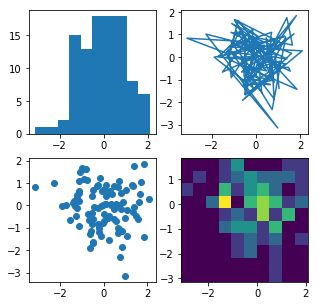

<h2>Jupyter notebook</h2>
<p>> jupyter-notebook: run the server </p>
<p>new> folder> python3> rename it: create new project </p>

<h3>shortcuts</h3>
<p>Esc: RunMod</p>
<p>Enter: EditMod</p>
<p>cellType> MarkCode</p>

<h3>magic commands</h3>
<p>%lsmagic: display all magic commads</p>
<p>%pws: current directory</p>
<p>%matplotlib inline: show the datadirams with in natebook</p>
<p>%%timeit: find the time this operation takes</p>


```python
print("hello")
```

    hello
    


```python
name = "the ceser"
```


```python
name
```


    'thariskan'


```python
%lsmagic
```


    Available line magics:
    %alias  %alias_magic  %autoawait  %autocall  %automagic  %autosave  %bookmark  %cd  %clear  %cls  %colors  %config  %connect_info  %copy  %ddir  %debug  %dhist  %dirs  %doctest_mode  %echo  %ed  %edit  %env  %gui  %hist  %history  %killbgscripts  %ldir  %less  %load  %load_ext  %loadpy  %logoff  %logon  %logstart  %logstate  %logstop  %ls  %lsmagic  %macro  %magic  %matplotlib  %mkdir  %more  %notebook  %page  %pastebin  %pdb  %pdef  %pdoc  %pfile  %pinfo  %pinfo2  %popd  %pprint  %precision  %prun  %psearch  %psource  %pushd  %pwd  %pycat  %pylab  %qtconsole  %quickref  %recall  %rehashx  %reload_ext  %ren  %rep  %rerun  %reset  %reset_selective  %rmdir  %run  %save  %sc  %set_env  %store  %sx  %system  %tb  %time  %timeit  %unalias  %unload_ext  %who  %who_ls  %whos  %xdel  %xmode
    
    Available cell magics:
    %%!  %%HTML  %%SVG  %%bash  %%capture  %%cmd  %%debug  %%file  %%html  %%javascript  %%js  %%latex  %%markdown  %%perl  %%prun  %%pypy  %%python  %%python2  %%python3  %%ruby  %%script  %%sh  %%svg  %%sx  %%system  %%time  %%timeit  %%writefile
    
    Automagic is ON, % prefix IS NOT needed for line magics.


```python
%%HTML
<!DOCTYPE html>
<html>
<body>

<h2>HTML Iframes</h2>
<p>You can use the height and width attributes to specify the size of the iframe:</p>

<iframe src="https://www.youtube.com/watch?v=HW29067qVWk" height="200" width="300" title="Iframe Example"></iframe>
</body>
</html>
```


<!DOCTYPE html>
<html>
<body>

<h2>HTML Iframes</h2>
<p>You can use the height and width attributes to specify the size of the iframe:</p>

<iframe src="https://www.youtube.com/watch?v=HW29067qVWk" height="200" width="300" title="Iframe Example"></iframe>
</body>
</html>


```python
%lsmagic
```


    Available line magics:
    %alias  %alias_magic  %autoawait  %autocall  %automagic  %autosave  %bookmark  %cd  %clear  %cls  %colors  %config  %connect_info  %copy  %ddir  %debug  %dhist  %dirs  %doctest_mode  %echo  %ed  %edit  %env  %gui  %hist  %history  %killbgscripts  %ldir  %less  %load  %load_ext  %loadpy  %logoff  %logon  %logstart  %logstate  %logstop  %ls  %lsmagic  %macro  %magic  %matplotlib  %mkdir  %more  %notebook  %page  %pastebin  %pdb  %pdef  %pdoc  %pfile  %pinfo  %pinfo2  %popd  %pprint  %precision  %prun  %psearch  %psource  %pushd  %pwd  %pycat  %pylab  %qtconsole  %quickref  %recall  %rehashx  %reload_ext  %ren  %rep  %rerun  %reset  %reset_selective  %rmdir  %run  %save  %sc  %set_env  %store  %sx  %system  %tb  %time  %timeit  %unalias  %unload_ext  %who  %who_ls  %whos  %xdel  %xmode
    
    Available cell magics:
    %%!  %%HTML  %%SVG  %%bash  %%capture  %%cmd  %%debug  %%file  %%html  %%javascript  %%js  %%latex  %%markdown  %%perl  %%prun  %%pypy  %%python  %%python2  %%python3  %%ruby  %%script  %%sh  %%svg  %%sx  %%system  %%time  %%timeit  %%writefile
    
    Automagic is ON, % prefix IS NOT needed for line magics.


```python
%matplotlib inline
```


```python
import matplotlib.pyplot as plt
import numpy as np

np.random.seed(19680801)
data = np.random.randn(2, 100)

fig, axs = plt.subplots(2, 2, figsize=(5, 5))
axs[0, 0].hist(data[0])
axs[1, 0].scatter(data[0], data[1])
axs[0, 1].plot(data[0], data[1])
axs[1, 1].hist2d(data[0], data[1])

plt.show()
```





```python
%%timeit
hello = [n*n for n in range(100)]
```

    12.1 µs ± 904 ns per loop (mean ± std. dev. of 7 runs, 100000 loops each)
    
